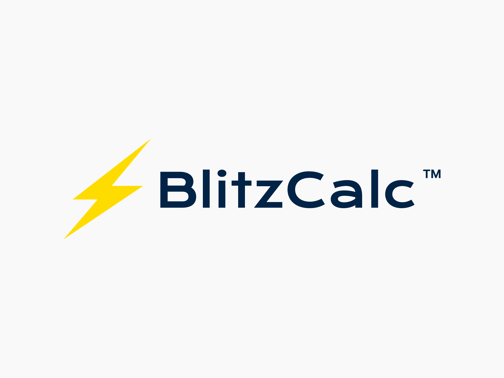
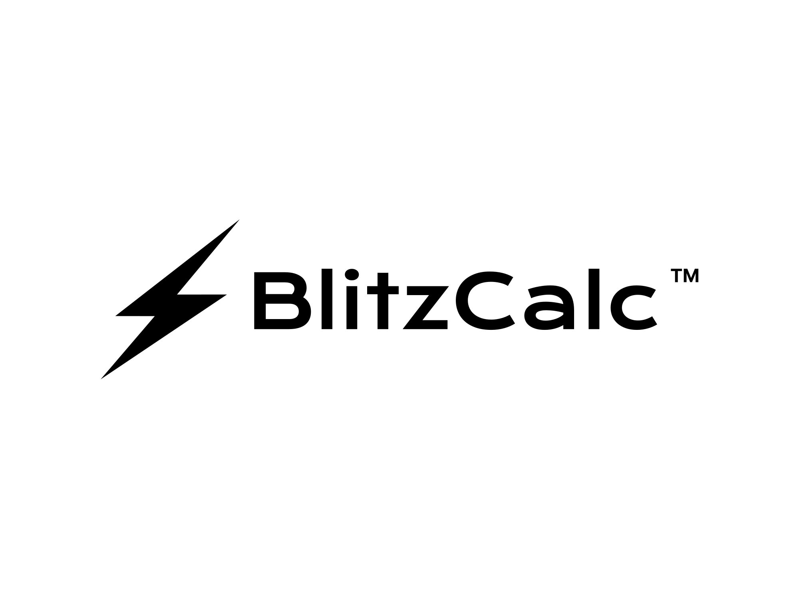
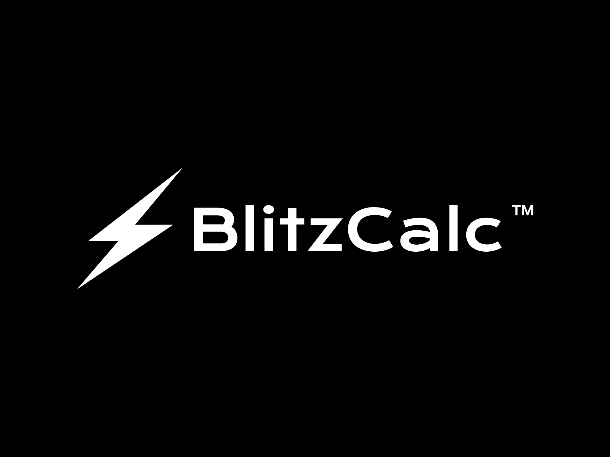
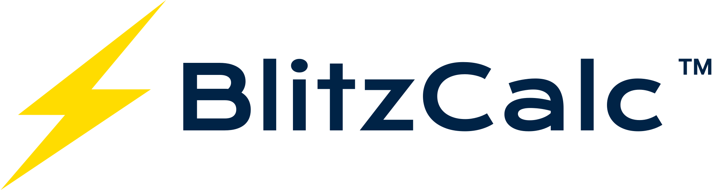
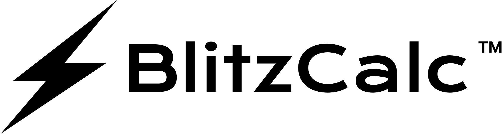
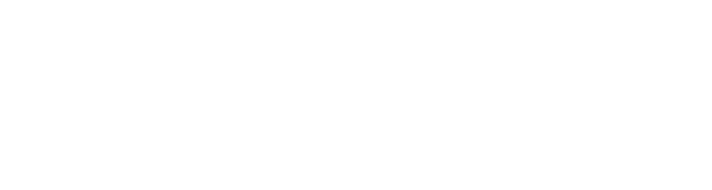

_Durand Antonin_  
_Jougla Maxime_  
_Parciany Benjamin_  
_Zehren William_

<h1 style="color:#5d79e7; text-align: center"> Charte graphique de la SAE S5 </h1>

<h1 style="color:#5d79e7; text-align: center; margin-top: 100px"> Table des matières</h1>

<ol>
    <li> <a href="#introduction"> Introduction  </a> </li>
    <li> <a href="#elemCG"> Eléments de la charte graphique  </a> </li>
    <ol>
        <li> <a href="#logo"> Logo </a> </li>
        <li> <a href="#couleurs"> Couleurs </a> </li>
        <li> <a href="#police"> Police </a> </li>
    </ol>
</ol>

<h2 style="color:#5dbee7; page-break-before: always" id="introduction"> Introduction </h2>

Ce document sert à définir la charte graphique qui sera utilisée durant notre projet. Il nous permet donc de nous y référer lors de la création de pages ou lors de l'ajout de nouveaux modules sur le site. 

<h2 style="color:#5dbee7; page-break-before: always" id="elemCG"> Eléments de charte graphique </h2>

<h3 style="color:#5dbee7; page-break-before: always" id="logo"> Logo </h3>

Ce logo est une combinaison lettres-images. Le nom, BlitzCalc, associe les mots Blitz et Calc. Le premier, Blitz, signifie en allemand "éclair" et le deuxieme, Calc, est un apocope du mot calcul. L'éclair jaune (sur la version normale) représente la vitesse de calcul et la précision acquise grâce au kit cluster hat.
Le logo à plusieurs déclinaisons ainsi que des favicons. 

<h4>Version normale</h4>

<h4>Version noire</h4>

<h4>Version blanche</h4>

<h4>Version normale transparente</h4>

<h4>Version noire transparente</h4>

<h4>Version noire transparente</h4>

<h4>Favicon normal</h4>

<h4>Favicon noir</h4>

<h4>Favicon blanc</h4>

<h3 style="color:#5dbee7; page-break-before: always" id="couleurs"> Couleurs </h3>

<h4>Couleur de fond :</h4>

Cette couleur représente le calme et la douceur. Elle permet à l'utilisateur de se sentir à l'aise sur le site et permet d'éviter d'utiliser du blanc, qui est plus aggressif que le gris. 

#BDD4E7  
elprimo

<h4>Couleur principale :</h4>

Cette couleur représente la joie, la chaleur et la puissance. Elle permet également à l'utilisateur de se sentir à l'aise sur le site, mais également de rappeler la vitesse de calcul à disposition sur notre site. 

#002346  
elprimo

<h4>Couleur d'accent :</h4>

Cette couleur symbolise la sagesse, la vérité et sérénité. Elle permet aussi à l'utilisateur de se sentir bien sur le site, tout en lui rappellant que notre site est un lieu de vérité et que notre promesse d'apporter des résultats rapide est tenue. 

#FFDC00  
elprimo

<h3 style="color:#5dbee7; page-break-before: always" id="police"> Police </h3>

<h4>Police du site :</h4>

Poppins

Cette police est une police géométrique sans empattement. Ses traits simples et modernes conviennent bien à un site basé sur le calcul haute performance.