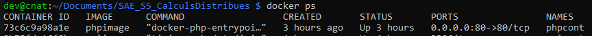
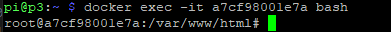
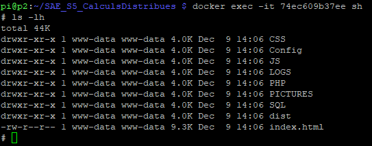
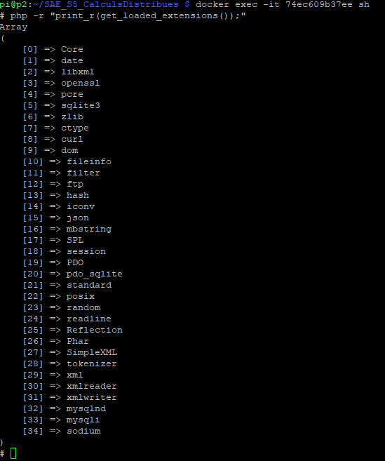
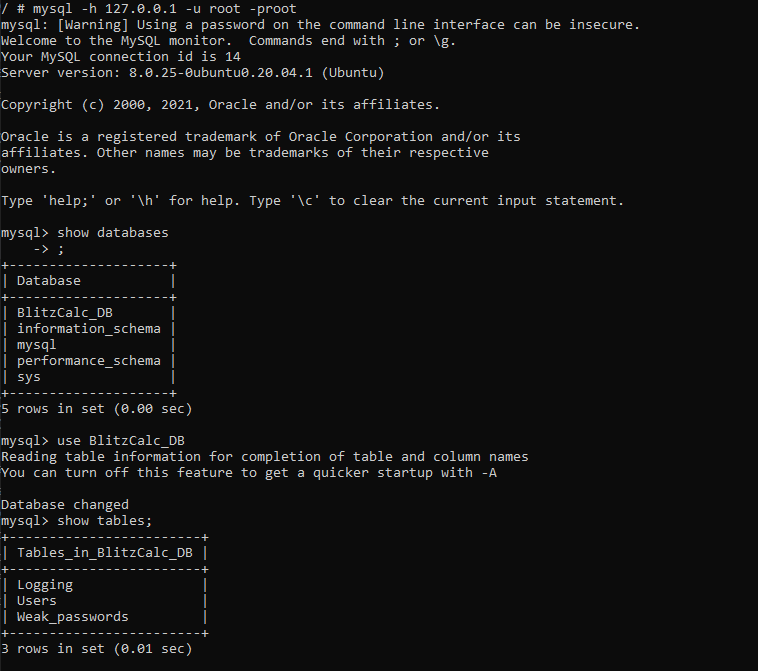
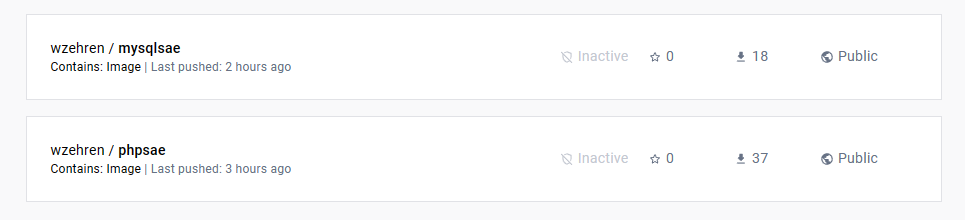
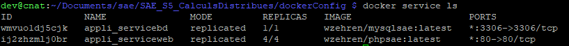

_Durand Antonin_ <br>
_Jougla Maxime_ <br>
_Parciany Benjamin_ <br>
_Zehren William_

<h1 style="color:#5d79e7; text-align: center"> Compte rendu installation application </h1>

<h1 style="color:#5d79e7; text-align: center; margin-top: 100px"> Table des matières</h1>

<ul>
<li><a href="#introduction">I- Introduction </a></li>
<li><a href="#installationKitCluster">II- Installation du kit Cluster hat </a></li>
<ul>
    <li><a href="#I_A"> A) Choix des images pour le kit Cluster Hat </a></li>
    <li><a href="#I_B"> B) Installation des images sur chaque Raspberry pi et premier démarrage </a></li>
    <li><a href="#I_C"> C) Configuration du ssh des Raspberry pi du kut Cluster Hat </a></li>
</ul>
<li><a href="#II_installationApplication">III- Installation de l'application </a></li>
<ul>
    <li><a href="#III_introduction">A) Introduction </a></li>
    <li><a href="#III_creationImageWeb">B) Création de l'image pour le serveur web </a></li>
    <li><a href="#III_creationImageBaseDonnees">C) Création de l'image pour la base de données </a></li>
    <li><a href="#III_creationDockerSwarm">D) Création du docker swarm </a></li>
    <li><a href="#III_creationStackAppli">E) Création du stack de l'application </a></li>
</ul>
</ul>

<h2 style="color:#5d79e7; page-break-before: always" id="introduction"> I- Introduction </h2>

Dans ce rapport seront présentées les différentes étapes et installations effectuées pour mettre en place le kit Cluster hat, ainsi que l'application qui sera hébergée sur ce dernier.
En premier lieu, seront montrées les différentes étapes pour mettre en route le kit Cluster, de la création de l'iso pour le Raspberry principal, en passant par l'allumage des 4 Raspberry Pi Zero, à l'installation de différents utilisateurs et logiciels pour manager ce dernier.
Puis, dans un second temps, sera présenté comment l'application est installée, hébergée et gérée sur le kit Cluster à l'aide de docker swarm.

<h2 style="color:#5d79e7; page-break-before: always" id="installationKitCluster"> II- Installation du kit Cluster hat  </h2>

<h3 style="color:#5d79e7" id="I_A"> A) Choix des images pour le kit Cluster Hat </h3>

La première étape est le choix des images pour le RPI 4 host, et les RPI Zero. Nous avons choisit de prendre ces dernières sur le site <a href="https://clusterctrl.com/setup-software"> Cluster CTRL </a>, car il fournit des images permettant d'utiliser et contrôler facilement le cluster.
Ainsi, **CNAT-Desktop Controller** est l'image du RPI host, et **Lite Bullseye image PN** est l'image pour le N-ième RPI zero. Le premier RPI zero aura l'image _P1_, le deuxième _P2_, le troisième _P3_ et le quatrième _P4_. Comme les Raspberry du kit Cluster Hat ont des processeurs 32 bits, par conséquent il est nécessaire de prendre la version 32 bits de ces images, qui est aussi disponible sur le site.
L'avantage de ces images et plus précisément l'image du RPI host, est que cette dernière utilise la méthode NAT (Network Address Translation) pour créer un sous-réseau **172.19.181.0/24**, où chaque RPI zero se verra assigner une adresse ip fixe. Par exemple, le premier RPI zero aura l'adresse _172.19.181.1_, et ainsi de suite. Le RPI host aura l'adresse _172.19.181.254_.

<h3 style="color:#5d79e7" id="I_B"> B) Installation des images sur chaque Raspberry Pi et premier démarrage </h3>

La deuxième étape consiste à l'installation des images sur les cartes micro sd du RPI host et des 4 RPI Zero. Pour ce faire, nous avons utilisé le logiciel **Raspberry Pi Imager**, qui comme **balenaEtcher**, permet de flasher des images sur différents supports physiques comme une carte micro sd ou un disque dur.
L'avantage de **Raspberry Pi Imager** est qu'il permet de personnaliser l'image qu'on veut flasher, en activant le _ssh_, et en créant un utilisateur _pi_ dans notre cas. Cela nous évite par exemple à avoir à activer manuellement le ssh sur chaque RPI zero, où il aurait fallu monter chaque carte micro sd dans une distribution Linux, pour ensuite créer un fichier _ssh_ dans le répertoire _boot_.


<p style="font-style: italic"> 
Comme le montre l'image ci-dessus, pour flasher l'image à l'aide de Pi Imager, il faut en premier lieu sélectionner le système d'exploitation, dans notre cas l'image CNAT ou les images lite Bullseye. <br>
Puis dans un deuxième lieu, il faut choisir le support sur lequel installer le système d'exploitation, à savoir une carte micro sd dans notre situation.
Enfin, on peut modifier certains paramètres du système d'exploitation à installer à l'aide du rouage en bas à droite, et ensuite appuyer sur <b>Ecrire</b> pour installer ce dernier sur la carte micro sd.
</p>


<p style="font-style: italic">
L'image ci-dessus permet de montrer les paramètres les plus importants que nous avons utilisé pour chacune des images du kit Cluster Hat, comme l'activation du SSH et la définition d'un utilisateur et de son mot de passe. 
</p>

Une fois les images créées, installées sur les cartes micro sd, on allume le RPI host. 
Ensuite, on le met à jour manuellement, puis on crée un script bash pour faire en sorte qu'il soit à jour à chaque fois qu'il démarre.
Dans un second temps, on démarre le cluster de RPI zero grâce à la commande ci-dessous qui nous est fournie par l'image **CNAT** : 

```bash
dev@cnat:~$ clusterhat on
```

Si on veut éteindre le cluster, il suffit d'effectuer la commande suivante, qui est similaire à celle pour allumer le cluster.

```bash
dev@cnat:~$ clusterhat off
```

Pour vérifier que le cluster est allumé, on exécute la commande suivante qui permet d'obtenir toutes les adresses IP qui sont dans le _cache ARP_, et notamment les adresses IP des RPI zero.

```bash
dev@cnat:~ $ arp -a
? (172.19.181.2) at 00:22:82:ff:ff:02 [ether] on br0
? (172.19.181.4) at 00:22:82:ff:ff:04 [ether] on br0
? (172.19.181.1) at 00:22:82:ff:ff:01 [ether] on br0
? (172.19.181.3) at 00:22:82:ff:ff:03 [ether] on br0
```
Ainsi, le sous-réseau en **172.19.181.0** a été créé par le RPI host, pour contenir les 4 RPI zero.

<h3 style="color:#5d79e7; page-break-before: always" id="I_C"> C) Configuration du ssh des Raspberry pi du kut Cluster Hat </h3>

Ensuite, la troisième étape est la configuration du système de connexion en ssh entre le RPI host et les 4 RPI zero, dans les 2 sens, pour faciliter la communication entre le RPI host et ces derniers. 

Dans un premier temps, on change le hostname de chaque RPI zero. Le **hostname**, ou nom d'hôte, est une étiquette que l'on peut donner à un appareil dans un réseau. Dans notre cas, nous allons attribuer un hostname pour chaque RPI zero, stockés dans le fichier _/etc/hosts/_ du RPI host. On peut ainsi utiliser ce hostname au lieu de l'adresse IP du RPI zero lors de la connexion en ssh entre le RPI host et ce dernier.
De la même manière, pour pouvoir utiliser ce hostname pour se connecter au RPI host ou autre RPI zero depuis un autre RPI zero, il faut ajouter les adresses IP de ces derniers et les hostnames associés dans _/etc/hosts/_ du RPI zero en question.

Pour vérifier que cela fonctionne, on regarde les hostnames accessibles depuis le RPI host.
```bash
dev@cnat:~$ cat /etc/hosts
127.0.0.1       localhost
::1             localhost ip6-localhost ip6-loopback
ff02::1         ip6-allnodes
ff02::2         ip6-allrouters

127.0.1.1       cnat
172.19.181.1 pi1
172.19.181.2 pi2
172.19.181.3 pi3
172.19.181.4 pi4
```

Ensuite on vérifie qu'on peut se connecter à un RPI zero depuis le RPI host en utilisant son hostname.
```bash
dev@cnat:~ $ ssh pi@pi2
pi@pi2 password:
Linux p2 6.1.21+ #1642 Mon Apr  3 17:19:14 BST 2023 armv6l

The programs included with the Debian GNU/Linux system are free software;
the exact distribution terms for each program are described in the
individual files in /usr/share/doc/*/copyright.

Debian GNU/Linux comes with ABSOLUTELY NO WARRANTY, to the extent
permitted by applicable law.
Last login: Fri Dec  1 14:51:07 2023 from 172.19.181.254
pi@p2:~ $
```

Dans un second temps, on va faire en sorte de pouvoir se connecter en ssh à un RPI zero depuis le host et inversement sans avoir à préciser un mot de passe, ce qui va être important pour certains programmes de calculs distribués à venir, et pour gagner en rapidité. 
Pour ce faire, depuis le RPI host, nous allons configurer le ssh à l'aide du fichier **.ssh/config** dont le format est le suivant :
```bash
Host hostname1
    SSH_OPTION value
    SSH_OPTION value
```
Ces 3 lignes permettent d'ajouter des options de connexion en ssh à un autre système. Dans notre cas, pour la connexion au premier RPI zero, on remplace **hostname1** par le nom que nous voulons utiliser pour se connecter à ce dernier.
Ensuite, la première option que nous allons mettre est le hostname du RPI zero sur lequel se connecter en ssh, dans notre cas _pi1_.
Enfin, on indique l'utilisateur du RPI zero à utiliser pour établir la connexion, qui est dans notre cas _pi_.
Après avoir écrit et adapté ces lignes pour les 3 autres RPI zero, on enregistre les modifications et le **.ssh/config** ressemble désormais à cela :
```bash
dev@cnat:~ $ cat .ssh/config
Host pi1
    Hostname pi1
    User pi
Host pi2
    Hostname pi2
    User pi
Host pi3
    Hostname pi3
    User pi
Host pi4
    Hostname pi4
    User pi
```

On utilise la commande **ssh-keygen -t rsa** sur chaque RPI zero. Cela nous génère un couple de clés privée/publique, et nous enregistrons la clé publique générée dans le RPI host grâce à la commande **ssh-copy-id @cnat**. 
Une fois cela fait, on peut se connecter en ssh au RPI host depuis n'importe quel RPI zero sans avoir à fournir un mot de passe comme le montre la commande ci-dessous :
```bash
dev@cnat:~ $ ssh pi1
Linux p1 6.1.21+ #1642 Mon Apr  3 17:19:14 BST 2023 armv6l

The programs included with the Debian GNU/Linux system are free software;
the exact distribution terms for each program are described in the
individual files in /usr/share/doc/*/copyright.

Debian GNU/Linux comes with ABSOLUTELY NO WARRANTY, to the extent
permitted by applicable law.
Last login: Fri Dec  1 20:13:44 2023 from 172.19.181.254
pi@p1:~ $
```

Il ne reste plus qu'à effectuer les mêmes commandes sur le RPI host, pour pouvoir se connecter en ssh à n'importe quel RPI zero depuis ce dernier sans avoir à entrer de mot de passe.

<h2 style="color:#5d79e7; page-break-before: always" id="II_installationApplication"> III- Installation de l'application  </h2>

<h3 style="color:#5d79e7" id="III_introduction"> A) Introduction </h3>

Une fois le kit Cluster configuré, et les 4 pi zero accessibles, nous allons installer l'application en utilisant docker swarm.
Docker swarm est une fonctionnalité avancée de docker permettant de gérer un cluster de containers et un ensemble de services. 
Il est composé d'un manager, le RaspberryPi principal dans notre cas, qui s'occupe de gérer les différents workers, et services du docker swarm. Il peut ajouter, supprimer un worker, ajouter, modifier et supprimer un service.
Un worker ne possède pas de droits et son seul rôle est d'exécuter les tâches données par le manager, soit un ou plusieurs services.
L'avantage de docker swarm est qu'il permet d'assurer la haute disponiblité des services en gérant automatiquement le fail-over et le load-balancing, dans notre cas, l'application doit être disponible en permanance.
Dans notre situation, chaque worker est un RaspberryPi zero.

Nous aurons un service web qui sera le front-end et le back-end du site. Il aura 4 réplicas hébergés sur chaque noeud worker RPI zero, ce qui permet au site d'être accesssible si l'un de ces derniers rencontre une erreur.
Ensuite, un autre service sera la base de données MySql de l'application, avec 1 réplica qui sera hébergé sur le noeud manager RPI Host.

Avant d'initialiser la swarm, il nous faut tester les différentes images sur le RPI Host et les RPI zero, pour s'assurer de leur bon fonctionnement. On créé donc un nouveau dossier dockerConfig au même niveau que le src dans le RPI Host pour y mettre tous les dockerfiles et les différents fichiers de configuration. 

<h3 style="color:#5d79e7" id="III_creationImageWeb"> B) Création de l'image pour le serveur web </h3>

Pour créer le service web de notre application, nous avons besoin d'une image docker personnalisée.  

Nous avons décidé de choisir l'image de base **php:8.2-apache** car cette dernière est compatible avec l'architecture armv6 des quatre RPI zero et qu'elle contient à la fois un serveur web capable de lire et d'exécuter des fichiers html et du js ainsi que des fichiers php grâce au module présent dans Apache. 
Elle doit contenir l'ensemble du front et back-end de l'application, soit les fichiers du site web. 

Ensuite, on crée notre image personnalisée à l'aide d'un fichier **dockerfile**. Ce dockerfile va contenir des instructions pour nous permettre de créer une image standardisée et contenant les différents fichiers dont nous avons besoin sans devoir les intégrer manuellement à nos conteneurs. Chaque conteneur / service créé à partir de cette image personnalisée sera par conséquent identique et contiendra tout le nécéssaire pour l'éxécution de notre site web. 

En premier lieu, on se retrouve donc avec un dockerfile nommé dockerfilePHP tel que : 

```dockerfile

FROM php:8.2-apache

COPY ./src/ /var/www/html/

COPY ./dockerConfig/php.ini-development /usr/local/etc/php/

COPY ./dockerConfig/php.ini-production /usr/local/etc/php/

RUN chown -R www-data:www-data /var/www/html/

RUN docker-php-ext-install mysqli && docker-php-ext-enable mysqli
```

Ce dockerfile va donc créer une image personnalisée à partir de l'image existante **php:8.2-apache**, puis va copier l'intégralité des pages du site dans le répertoire _/var/www/html/_ du conteneur utilisant cette image, car c'est le répertoire par défaut dans lequel apache va chercher les fichiers web. 
Ensuite, on copie les différents fichiers de configuration pour les pages en PHP, qui vont par exemple nous permettre d'afficher les erreurs et de charger les extensions PHP, dans notre cas, l'extension MySQLI pour se connecter à un serveur MySQL depuis un script PHP. 
Puis, on attribue le répertoire de l'application, on donne les droits à l'utilisateur _www-data_ qui execute le serveur apache au répertoire de l'application. 
Enfin, on installe puis on active l'extension PHP de MySQLi.

Après avoir écrit ce dockerfile, on va donc tester son bon fonctionnement sur le RPI Host. 

Pour tester cette image personnalisée, on se met sur un des RPI zero et on créé l'image depuis ce dernier pour s'assurer que l'image à bien été créée et est bien compatible avec les RPI zero. 

On commence donc par créer l'image qui découle de ce dockerfile avec la commande suivante (cette commande doit être exécutée au même niveau que le répertoire _src_) : 

```bash
docker build -t phpimage -f dockerConfig/dockerfilePHP .
```

Lorsqu'on a créé l'image, on démarre un conteneur avec la commande suivante : 

```bash
docker run --name phpcont -dit phpimage
```



Après le lancement du container, on s'y connecte en bash pour vérifier que les changements ont bien été pris en compte avec la commande :

```bash
 docker exec -it phpcont bash
```

On peut donc déjà vérifier que les fichiers ont bien été insérés dans le repertoire /var/www/html/ avec la commande ```pwd``` : 



On vérifie ensuite les droits ont bien été modifiés pour www-data sur les différents répertoires des fichiers du site web :



Enfin, on vérifie que MySQLi à bien été installé : 



<h3 style="color:#5d79e7; page-break-before: always" id="III_creationImageBaseDonnees"> C) Création de l'image pour la base de données </h3>

Après avoir créé le service web de notre application et confirmé son bon fonctionnement, nous avons pu passer à la réalisation du service bd de notre application. 

Pour créer le service bd de notre application, nous avons aussi besoin d'une image docker personnalisée.

Cette dernière se base sur l'image existante **mysql**, car elle contient déjà un système de gestion de base de données (SGBD).
Elle doit contenir la base de données de notre application.

Ensuite, on crée notre image personnalisée à l'aide d'un fichier **dockerfile**.

On créé donc un dockerfile dockerfileMYSQL tel que : 

```dockerfile
FROM clover/mysql:5.7

COPY ./database_script.sql /docker-entrypoint-initdb.d/

RUN chown -R mysql:mysql /docker-entrypoint-initdb.d/ \
    && chmod 755 -R /docker-entrypoint-initdb.d/

WORKDIR /docker-entrypoint-initdb.d/ 
```

Dans le dockerfile dockerfileMYSQL, il nous a fallu choisir une image mysql compatible avec l'architecture 32 bits armv7 de notre RPI Host. Cependant cette dernière n'existant pas dans la version officielle de l'image mysql, il a fallu choisir une image non officielle.
Nous avons donc décidé de choisir l'image clover/mysql. Cette image ayant plus de 10000 pulls, nous en avons déduit qu'elle était fiable et fonctionnelle.

Il nous faut également placer notre script .sql dans un répertoire bien particulier du conteneur qui sera créé à partir de cette image, le répertoire **/docker-entrypoint-initdb.d/**. Ce répertoire permet d'exécuter facilement le script .sql pour créer la base de données après la création du container. 
Le script quant à lui créé un utilisateur pour manipuler la base de données, deux utilisateurs de base dans l'application et instancie les trois tables SQL.  

On peut alors, comme pour notre dockerfilePHP, commencer par build l'image à partir du dockerfileMYSQL : 

```bash
docker build -t sqlimage -f ../../dockerConfig/dockerfileMYSQL .
```
On créé donc une image personnalisée nommée sqlimage à partir du dockerfileMYSQL. Cette commande doit être exécutée a l'endroit ou est situé le script .sql. 

Lorsqu'on a build l'image sql on peut démarrer un container avec la commande suivante : 

```bash
docker run --name mysqlcont -dit sqlimage
```

On créé donc un conteneur nommé mysqlcont à partir de l'image sqlimage. 
Puis on se connecte en sh (bash n'existant pas sur cette image) à ce conteneur : 

```bash
docker exec -it mysqlcont sh
```

Après cela, il faut executer la commande suivant pour se accèder à mysql : 

```bash
mysql -h 127.0.0.1 -u root -proot
```

Pour exécuter le script .sql et donc l'insérer dans le conteneur, il faut effectuer la commande suivante dans le dossier ```/docker-entrypoint-initdb.d/``` : 

```bash 
\. database_script.sql
```

Le script .sql à bien été executé au lancement du conteneur comme le montre l'image suivante : 




<h3 style="color:#5d79e7" id="III_creationDockerSwarm"> D) Création du docker swarm</h3>

On installe docker s'il ne l'est pas encore.
Ensuite, on initialise un docker swarm, et on rajoute 4 workers, où le manager est le RasperryPi principal, et chaque worker est un RaspberryPi zero.
L'objectif ensuite est d'avoir 1 stack contenant l'application déployée et 1 autre stack contenant l'application en production. 
Ce docker swarm contiendra deux services, respectivement un service pour le serveur web et un service pour le serveur sql. 

Après avoir vérifié le bon fonctionnement de nos conteneurs et des deux services php et mysql, on crée le swarm : 

On commence donc par initialiser le swarm dans le RPI Host avec la commande : 

```bash
docker swarm init --advertise-addr 172.19.181.254
```

On fait ensuite rejoindre les workers (donc les 4 RPI0) avec la commande : 

```bash
docker swarm join --token SWMTKN-1-2lcnd86mpg7d8x64b1nyspdm6ezhujg6tbdqzxk4ugr3vhio2r-ctzz5dlvv7q0b73bl7kgc5n6n 192.168.0.25:2377
```

Etant donné que l'on veut héberger notre service web uniquement dans les quatre RPI Zero, on doit leur donner à chacun un label spécifique. Lorsqu'un service sera créé, on pourra lui indiquer une contrainte de placement en fonction d'un label. Par exemple, on associe aux quatre RPI zero un label service=web, si on créé un service avec pour contrainte de placement service=web, ce dernier ira placer ses réplicas sur les quatre RPI Zero et pas sur le RPI Host. 

On utilise donc la commande suivante pour donner un label aux différents nodes qui vont héberger le service web : 

```bash
docker node update --label-add service=web p2 
```

On effectue la même opération pour le service sql avec la commande suivante : 

```bash 
docker node update --label-add service=sql cnat
```

<h3 style="color:#5d79e7" id="III_creationStackAppli"> E) Création du stack de l'application </h3>

Après avoir créé les deux images et initialisé le swarm, nous allons créer un stack dans le swarm nous permettant de déployer deux services liés aux deux images. 

Un stack est un outil permettant de gérer un ensemble de services, sur plusieurs machines, sur plusieurs noeuds, et selon certaines contraintes au sein d'un swarm. Un service correspond à une définiton de taches à exécuter par un ou plusieurs nodes du swarm. 

Ainsi, dans notre stack, nous allons créer un service BD qui lancera un conteneur se basant sur l'image sqlimage précédemment créée, ainsi qu'un service web qui lancera un conteneur se basant sur l'image phpimage précédemment créée. 

Cependant, comme énoncé précédemment, on souhaite déployer le service web sur quatre noeuds, l'image PHP doit donc également être présente sur ces quatre noeuds. 
Pour ce faire, nous avons choisi de mettre en ligne nos deux images PHP et MySQL sur la banque d'images docker DockerHub.

Pour mettre nos images en ligne, il a fallu créer un compte docker ainsi qu'un repository docker par images a stocker :  



En local, pour mettre nos images en ligne, il a fallu se connecter a notre compte docker hub avec la commande suivante :
```bash
docker login --username=wzehren --email=williamzehrentravail@gmail.com
```
Et entrer le mot de passe du compte.

Puis il a fallu créer un alias aux images à push de la même manière que le repository avec la commande suivante : 

Pour l'image phpimage
```bash
docker tag phpimage wzehren/phpsae
```
Pour l'image sqlimage
```bash
docker tag sqlimage wzehren/mysqlsae
```

On peut ensuite les push sur docker hub avec la commande suivante : 

Pour l'image phpimage
```bash
docker push wzehren/phpsae
```

Pour l'image sqlimage
```bash
docker push wzehren/mysqlsae
```

Après avoir réalisé ces étapes, on peut se placer sur chacun des RPI (zero et host) pour pull, et donc installer leurs images respectives (wzehren/phpsae pour les RPI zero et wzehren/mysqlsae pour le RPI Host) avec la commande suivante : 

Pour l'image phpimage
```bash
docker pull wzehren/phpsae
```

Pour l'image sqlimage
```bash
docker pull wzehren/mysqlsae
```

Ensuite, on créé un fichier de configuration .yml pour le stack qui va permettre de créer automatiquement les deux services, en spécifiant le nombre de réplicas, leurs redirections de ports ainsi que les contraintes de placement de ces derniers sur les noeuds : 

```yml
version: "3.0"

services:
  serviceweb:
    image: wzehren/phpsae
    ports:
      - "80:80"
    deploy:
      placement:
        constraints: [node.labels.service == web ]
      replicas: 4

  servicebd:
    image: wzehren/mysqlsae
    ports:
      - "3306:3306"
    deploy:
      placement:
        constraints: [node.labels.service == sql ]
      replicas: 1
```

Ensuite, pour déployer le stack sur le swarm, on utilise la commande : 

```bash 
docker stack deploy --compose-file docker-compose-stack.yml appli
```

Pour voir que les services sont bien déployés, on peut effectuer la commande : 

```bash
docker service ls
```

Ce qui donne le résultat suivant : 



On voit bien que les deux services ont été créés et ont bien été répliqués.
Pour visualiser les différents services de manière plus claire, on créé un conteneur visualizer qui permet d'observer les différents services présents dans le swarm et leur répartition dans les différents nodes. 

  

<br>
<br>

**Une fois l'application déployée, on peut accèder au site web à partir de l'adresse ip suivante :** http://85.170.243.176/ 

**Le site web est donc bien accessible et on peut se connecter à son compte normalement** 

On peut également accèder au visualizer depuis l'adresse ip suivante : http://85.170.243.176:5000/ 

(Cette adresse n'est accessible qu'a des fins de test et ne sera plus accessible lors du deploiement du site web)
