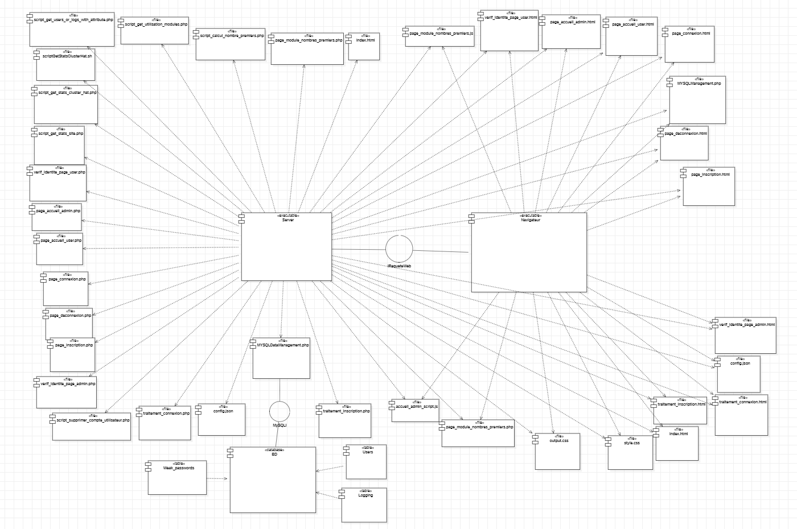

_Durand Antonin_ <br>
_Jougla Maxime_ <br>
_Parciany Benjamin_ <br>
_Zehren William_

<h1 style="color:#5d79e7; text-align: center"> Dossier de conception </h1>

<h1 style="color:#5d79e7; text-align: center; margin-top: 100px"> Table des matières</h1>

<ol>
    <li> <a href="#introduction"> Introduction  </a> </li>
    <li> <a href="#livr1"> Conception Livrable 1 </a> </li>
    <ol>
        <li> <a href="#concepArchi"> Conception architecturale </a> </li>
        <li> <a href="#concepDeta"> Conception détaillée </a> </li>
    </ol>
    <li> <a href="#livr2"> Conception Livrable 2 </a> </li>
    <ol>
        <li> <a href="#concepArchi2"> Conception architecturale </a> </li>
        <li> <a href="#concepDeta2"> Conception détaillée </a> </li>
    </ol>
    <li> <a href="#livr3"> Conception Livrable 3 </a> </li>
    <ol>
        <li> <a href="#concepArchi3"> Conception architecturale </a> </li>
        <li> <a href="#concepDeta3"> Conception détaillée </a> </li>
    </ol>
</ol>


<h2 style="color:#5d79e7; page-break-before: always" id=introduction> Introduction </h2>

Ce document est un dossier de conception divisé en plusieurs parties. Il sera constitué de la conception architecturale et détaillée de chaque livrable. Il aura pour but de donner de renseigner toutes les informations sur la conception du site ainsi que des diagrammes permettant de la représenter graphiquement. 

Le premier livrable consiste en la réalisation des bases du site web, à savoir les pages principales. Il consiste également en la configuration du kit cluster hat, et en l'installation du site web sur ce dernier. 

<h2 style="color:#5d79e7; page-break-before: always" id=livr1> Conception Livrable 1 </h2>

<h3 style="color:#5d79e7;" id=concepArchi> Conception architecturale </h3>

Le domaine du problème est le site web BlitzCalc, on décompose donc ce système en sous-systèmes. 

On définit ci-dessous une conception architecturale du site web avec : le serveur web côté serveur, le navigateur web côté client et la base de données. 

On utilise donc l'approche orientée objet pour repérer les différents objets du problème. On utilise également la vue composant-connecteur pour représenter le système ainsi que l'ensemble des composants du système d'un point de vue statique.

On introduit également le serveur, le navigateur web et la base de données. 

Le composant serveur est dans le kit cluster hat et le navigateur est un composant présent dans les machines des utilisateurs. Le composant base de données quant à lui est installé sur le kit cluster hat. 

| Objet                                    | Etat                                                        | Comportement                           |
|------------------------------------------|-------------------------------------------------------------|----------------------------------------|
| page_inscription.php                     |                                                             |                                        |
| page_connexion.php                       |                                                             |                                        |
| page_accueil.php                         |                                                             |                                        |
| page_accueil_user.php                    |                                                             |                                        |
| page_accueil_admin.php                   |                                                             |                                        |
| style.css                                |                                                             |                                        |
| Enum_fic_logs.php                        |                                                             |                                        |
| Enum_niveau_logger.php                   |                                                             |                                        |
| Enum_role_user.php                       |                                                             |                                        |
| Logger.php                               |                                                             |                                        |
| LoggerInstance.php                       |                                                             |                                        |
| Logging.php                              |                                                             |                                        |
| MYSQLDataManagement.php                  |                                                             |                                        |
| page_deconnexion.php                     |                                                             |                                        |
| traitement_connexion.php                 |                                                             |                                        |
| traitement_inscription.php               |                                                             |                                        |
| traitement_profil.php                    |                                                             |                                        |
| User.php                                 |                                                             |                                        |
| Utility.php                              |                                                             |                                        |
| verif_identite_page_admin.php            |                                                             |                                        |
| verif_identite_page_user_inscrit_only.php|                                                             |                                        |
| verif_identite_page_user.php             |                                                             |                                        |
| index.html                               |                                                             |                                        |
| Serveur Web                              | A tous les objets .php, .html, .css, .json, a une interface | Ecoute les requêtes du navigateur      |
| Navigateur Web                           |                                                             | Lit les fichiers, exécute des requêtes |
| Base de données                          | a les tables Logging, Users, Weak_passwords                 |                                        |


A partir de ce tableau, on peut définir les composants suivants : "page_accueil.php", "page_connexion.php", "page_inscription.php", "page_accueil_user.php", "page_accueil_admin.html", "style.css", "Enum_fic_logs.php", "Enum_niveau_logger.php","Enum_role_user.php","Enum_role_user.php","Logger.php","LoggerInstance.php","Logging.php","MYSQLDataManagement.php","page_deconnexion.php","Pagination.php","traitement_connexion.php","traitement_inscription.php","traitement_profil.php","User.php","Utility.php","verif_identite_page_admin.php","verif_identite_page_user_inscrit_only.php","verif_identite_page_user.php","index.html". 

Ces derniers sont des abstractions respectives des objets : "page_accueil.php", "page_connexion.php", "page_inscription.php", "page_accueil_user.php", "page_accueil_admin.html", "style.css", "Enum_fic_logs.php", "Enum_niveau_logger.php","Enum_role_user.php","Enum_role_user.php","Logger.php","LoggerInstance.php","Logging.php","MYSQLDataManagement.php","page_deconnexion.php","Pagination.php","traitement_connexion.php","traitement_inscription.php","traitement_profil.php","User.php","Utility.php","verif_identite_page_admin.php","verif_identite_page_user_inscrit_only.php","verif_identite_page_user.php","index.html".

On définit ensuite le composant "Navigateur", abstraction de l'objet "Navigateur web", qui correspond au client voulant accèder au site web. On définit également le composant "Serveur", abstraction de l'objet "Serveur web". Enfin, on définit le composant "Base de données", abstraction de l'objet "Base de données". 

On peut constater que certains composants d’objets sont similaires, on externalise donc le style de chaque page pour le mettre dans un objet, fichier appelé "style.css". Cela va être montré dans la partie conception 
détaillée. 

On crée aussi 4 packages, le premier appelé CSS contenant l'objet "style.css", le 
deuxième appelé HTML contenant l'objet "index.html", le troisième intitulé PHP contenant tous les objets en ".php" et le quatrième intitulé JSON contenant tous les objets ".json".

On représente les relations entre "BD" et 
"Logging","Users","Weak_passwords". 

<div style="text-align:center">

<p> Diagramme BD du livrable 1 </p>
</div>

Ensuite, représente les relations entre les packages dans le diagramme de packages ci-dessous.

<div style="text-align:center">

<p> Diagramme de packages du livrable 1 </p>
</div>

On va utiliser la vue composants-connecteurs pour modéliser le système.   

Les composants "Serveur" et "Navigateur" sont de stéréotype "executable", le composant "DB" est de stéréotype "database", les composants "Logging", "Users" et "Weak_passwords" qui sont de stéréotype "table" et enfin tous les autres composants sont de stéréotype "file".  

On a la même interface nommée "IRequeteWeb" entre "Navigateur" et "Serveur". On a des relations de dépendances entre "Serveur" et les composants de stéréotype "file". De même entre le "Navigateur" et les composants d'extension "html".  

Le composant "Serveur" interprète les composants en .php et envoi les fichiers html correspondants au "Navigateur".  

On a une interface entre les composants "Navigateur" et "Serveur" que l’on va nommer 
"IRequeteWeb". On a des relations de dépendances entre "Serveur" et les composants de stéréotype "file", de même entre le "Navigateur" et les composants d'extension "html".  

On modélise cette vue à l’aide d’un diagramme de composants ci-dessous :

On a une interface que l’on va nommer "MySqli" reliant le composant "MySQLDataManagement.php" avec le composant "Base de données". 

<div style="text-align:center">

<p> Diagramme de composants du livrable 1 </p>
</div>

L’étude du système ainsi que sa modélisation à l’aide de la vue composant-connecteur nous a 
permis de représenter le système qui est le site web. Nous allons représenter maintenant le système du point de vue de son déploiement à l’aide de la vue d’attribution.  

On définit donc trois noeuds principaux, le Navigateur, le RPI Host et Les quatre RPI Zero. 

**Remarque : Seulement un RPI Zero sur les quatres sera modélisé pour faciliter la compréhension du diagramme, mais ces derniers sont tous structurés de la même manière**

Le serveur et les pages sont stockées dans les quatre RPI Zero, dans un noeud contenant ces composants qu’on appele "Worker". Ce noeud "Worker" modélise le role de worker que les RPI Zero ont dans le swarm docker installé sur le Cluster. Ce même noeud est imbriqué dans un autre noeud, qui est le noeud "RPIs Zero" et qui modélise les quatre RPI Zero. 

La base de données quant à elle, est stockée dans le RPI Host, dans un noeud contenant ce composant qu’on appele "Manager". Ce noeud "Manager" modélise le role de manager que le RPI Host à dans le swarm docker installé sur le Cluster.
Ce même noeud est imbriqué dans un autre noeud, qui est le noeud "RPI Host" et qui modélise le RPI Host. 

De plus, comme le site web doit être accessible pour tous les ordinateurs étant sur le même réseau que la machine "Serveur Kit Cluster Hat", on a le composant Navigateur ainsi que les pages web envoyées par le serveur qui sont dans la machine du client, qu’on va appeler Client Web.

Ces noeuds contienent également chacun un composant SSH qui modélise la communication entre les différents noeud du système.

Il peut y avoir 0 ou n Client Web car plusieurs utilisateurs peuvent se connecteur au serveur (RPI Host + RPIs Zero). Il peut également y avoir 0 ou n "RPI Host" et 0 ou n "RPIs Zero", car des réplicas de ce serveur peuvent être créées.  


Enfin, les 2 machines sont reliées par une connexion internet, représentée par une relation d’association dans le diagramme.

<div style="text-align:center">

<p> Diagramme de deploiement du livrable 1 </p>
</div>

<h3 style="color:#5d79e7; page-break-before: always" id=concepDeta> Conception détaillée </h3> 

En ayant défini les dépendances et les associations entre tous les objets, on obtient alors une structure telle que : 

<div style="text-align:center">

<p> Diagramme de classes du livrable 1 (1)</p>
</div>

On commence par analyser les différentes classes .php, à savoir "Logger.php", "LoggerInstance.php", "Logging.php", "MySQLDataManagement.php", "User.php" et "Utility.php".

On analyse aussi les énumérations "Enum_fic_logs.php", "Enum_niveau_logger.php","Enum_role_user.php".

Pour faciliter l'analyse de ces dernieres, on réalise un diagramme de classe ne contenant que ces classes, leurs paramètres et leurs méthodes et ces énumérations. Il servira a modéliser les dépendances et les associations entre ces dernières. 

<div style="text-align:center">

<p> Diagramme de classes du livrable 1 (2)</p>
</div>

On analyse maintenant comment sont constitués les objets en .php, à savoir "page_accueil_admin.php", "page_accueil_user.php", "page_connexion.php", "page_deconnexion.php", "page_inscription.php".

La page "page_deconnexion.php" ne contient pas d'html et n'apparaitra jamais sur l'écran de l'utilisateur, elle permet uniquemement de déconnecter la session de l'utilisateur. 

La page "page_accueil_admin.php" ne contient qu'un lien de déconnexion contenu dans un ```<ul><li>``` lui-même contenu dans un ```<nav>```. Elle contient un ```<h1>``` qui permet d'afficher le nom de la page. Elle contient aussi un ```<h2>``` dans le ```<main>``` qui affiche le nom de l'admin.

La page "page_accueil_user.php" ne contient qu'un lien de déconnexion contenu dans un ```<ul><li>``` lui meme contenu dans un ```<nav>```.  Elle contient un ```<h1>``` qui permet d'afficher le nom de la page. Elle contient aussi un ```<h2>``` dans le ```<main>``` qui affiche le nom de l'utilisateur. 

La page "page_connexion.php" contient un ```<h2>``` qui permet d'afficher le nom de la page. Elle contient ensuite un ```<form>``` qui contient lui-même deux ```<div>``` qui contiennent chacun un ```<label>``` et un ```<input>``` de  type text. Ce sont les champs de notre formulaire. Ce ```<form>``` contient également un ```<input>``` de type submit qui correspond au bouton de validation. Cette page contient un deuxième ```<form>``` qui contient un ```<input>``` de type submit. Elle contient aussi un ```<p>``` servant à l'affichage des erreurs. Enfin, elle contient un ```<ul>``` dans un ```<nav>```avec deux ```<li>``` qui contiennent chacun un ```<a>``` avec un href.  

La page "page_inscription.php" contient un ```<h2>``` qui permet d'afficher le nom de la page. Elle contient ensuite un ```<form>``` qui contient lui-même six ```<div>``` qui contiennent chacun un ```<label>``` et un ```<input>``` de  type text. Ce sont les champs de notre formulaire. Ce ```<form>``` contient également un ```<input>``` de type submit qui correspond au bouton de validation. Cette page contient un deuxième ```<form>``` qui contient un ```<input>``` de type submit. Elle contient aussi un ```<p>``` servant à l'affichage des erreurs. Enfin, elle contient un ```<ul>``` dans un ```<nav>```avec deux ```<li>``` qui contiennent chacun un ```<a>``` avec un href.  

Nous allons ensuite effectuer la conception détaillée de la base de données. 
La base de données se décompose de 3 tables : 

La table Users comporte 7 colonnes, à savoir userId de type varchar, userMail de type varchar, login de type varchar, lastName de type varchar, firstName de type varchar, password de type varchar et role de type varchar. De plus, on a des contraintes d'intégrités sur les colonnes, le nombre de caractères maximum est de 36 pour la colonne userId, de 35 pour la colonne userMail, de 256 pour la colonne password et de 10 pour la colonne role. le nombre de caractères maximal est de 25 pour les colonnes login, lastName et firstName. On a également une clé primaire sur la colonne userId pour rendre les identifiants uniques et pour empecher le fait d'avoir deux tuples ayant le même login. Les colonnes ne peuvent par ailleurs pas être nulles. De plus, pour la colonne role, la valeur "USER" est insérée par défaut. 

La table Logging comporte 6 colonnes, à savoir logId de type varchar, logLevel de type varchar, userId de type varchar, date de type datetime, ip de type varchar et description de type text. De plus, on a des contraintes d'intégrités sur les colonnes, le nombre de caractères maximum est de 36 pour les colonnes logId et userId, de 10 pour la colonne logLevel, de 15 pour la colonne ip. On a également une clé primaire sur la colonne logId pour rendre les identifiants uniques et pour empecher le fait d'avoir deux tuples ayant le même login. On a aussi une clé étrangère sur la colonne userId, cette dernière fait référence à la clé primaire du même nom dans la table Users. Toutes les colonnes sauf logLevel ne peuvent par ailleurs pas être nulles. La colonne logLevel, doit être nulle ou doit contenir des valeurs de criticités d'alerte des logs ('DEBUG', 'INFO', 'WARNING', 'ERROR', 'CRITICAL'). De plus, pour la colone role, la valeur "USER" est insérée par défaut. 

La table Weak_passwords comporte une seule colonne password de type varchar avec des contraintes d'intégrité telles que : le nombre de caractères contenus dans cette colonne doit être de 256 au maximum et elle ne peut pas être nulle. 

<h2 style="color:#5d79e7;  page-break-before: always" id=livr2> Conception Livrable 2 </h2>

<h3 style="color:#5d79e7;" id=concepArchi2> Conception architecturale </h3>

Le domaine du problème est le site web BlitzCalc, on décompose donc ce système en sous-systèmes.

L'architecture reste la même que dans le livrable 1 cependant on doit rajouter des composants et en supprimer certains. 

Les composants qui sont supprimés de l'architecture sont les suivants : "verif_identite_page_user_inscrit_only.php", " Enum_fic_logs.php" et "script_recherche_users_par_mail.php". 

Les composants qui sont ajoutés au système sont les suivants :

| Objet                                      | Etat                                                        | Comportement                           |
|--------------------------------------------|-------------------------------------------------------------|----------------------------------------|
| accueil_admin_script.js                    |                                                             |                                        |
| page_module_nombres_premiers.js            |                                                             |                                        |
| script_get_stats_site.php                  |                                                             |                                        |
| script_get_stats_cluster_hat.php           |                                                             |                                        |
| scriptGetStatsClusterHat.sh                |                                                             |                                        |
| script_get_users_or_logs_with_attribute.php|                                                             |                                        |
| script_calcul_nombre_premiers.php          |                                                             |                                        |
| script_supprimer_compte_utilisateur.php    |                                                             |                                        |
| script_get_utilisation_modules.php         |                                                             |                                        |
| page_module_nombres_premiers.php           |                                                             |                                        |
| output.css                                 |                                                             |                                        |
            
A partir de ce tableau, on peut définir les composants suivants : "accueil_admin_script.js", "output.css", "page_module_nombres_premiers.js", "script_get_stats_site.php", "script_get_stats_cluster_hat.php","scriptGetStatsClusterHat.sh","script_get_users_or_logs_with_attribute.php","script_get_utilisation_modules.php","script_supprimer_compte_utilisateur.php","script_calcul_nombre_premiers.php" et "page_module_nombres_premiers.php".

Ces derniers sont des abstractions respectives des objets : "accueil_admin_script.js", "output.css", "page_module_nombres_premiers.js", "script_get_stats_site.php", "script_get_stats_cluster_hat.php","scriptGetStatsClusterHat.sh","script_get_users_or_logs_with_attribute.php","script_get_utilisation_modules.php","script_supprimer_compte_utilisateur.php","script_calcul_nombre_premiers.php" et "page_module_nombres_premiers.php".

Le composant "output.css" contient désormais le style de chaque composant concerné du site. Le composant "style.css" ne sert maintenant qu'a appeler des librairies nécéssaires pour le style. 

On crée aussi 6 packages, le premier appelé CSS contenant l'objet "style.css", le 
deuxième appelé HTML contenant l'objet "index.html", le troisième intitulé PHP contenant tous les objets en ".php", le quatrième intitulé JSON contenant tous les objets ".json", le cinquième intitulé BASH contenant l'objet "scriptGetStatsClusterHat.sh" et le sixième intitulé JS contient tous les objets ".js".

La base de données quant à elle ne change pas d'un point de vue architectural. 

<div style="text-align:center">

<p> Diagramme BD du livrable 2 </p>
</div>

On représente les relations entre les packages dans le diagramme de packages ci-dessous.

<div style="text-align:center">

<p> Diagramme de packages du livrable 2 </p>
</div>

On va utiliser la vue composants-connecteurs pour modéliser le système. 

Les composants "Serveur" et "Navigateur" sont de stéréotype "executable", le composant "DB" est de stéréotype "database", les composants "Logging", "Users" et "Weak_passwords" qui sont de stéréotype "table" et enfin tous les autres composants sont de stéréotype "file".  

On a la même interface nommée "IRequeteWeb" entre "Navigateur" et "Serveur". On a des relations de dépendance entre "Serveur" et les composants de stéréotype "file". De même entre le "Navigateur" et les composants d'extension "html", "json","js" et "css".  

Le composant "Serveur" interprète les composants en ".php", ".json", ".sh" et envoie les fichiers html correspondants au "Navigateur".  

On a une interface entre les composants "Navigateur" et "Serveur" que l’on va nommer 
"IRequeteWeb". On a des relations de dépendances entre "Serveur" et les composants de stéréotype "file", de même entre le "Navigateur" et les composants d'extension "html" "json" "css" et "js".  

On modélise cette vue à l’aide d’un diagramme de composants ci-dessous :

On a une interface que l’on va nommer "MySqli" reliant le composant "MySQLDataManagement.php" avec le composant "Base de données". 

<div style="text-align:center">

<p> Diagramme de composants du livrable 2 </p>
</div>

Le système qui héberge le site reste exactement le même que lors du livrable 1, à savoir trois noeuds principaux : le Navigateur, le RPI Host et Les quatre RPI Zero. 

**Remarque : Seulement un RPI Zero sur les quatres sera modélisé pour faciliter la compréhension du diagramme, mais ces derniers sont tous structurés de la même manière**

On représente donc ces noeuds de la même manière que dans le livrable précédent, grâce à un diagramme de déploiement. 

<div style="text-align:center">

<p> Diagramme de déploiement du livrable 2 </p>
</div>

<h3 style="color:#5d79e7; page-break-before: always" id=concepDeta2> Conception détaillée </h3>

En ayant défini les dépendances et les associations entre tous les objets, on obtient alors une structure telle que : 

<div style="text-align:center">

<p> Diagramme de classes du livrable 2 (1)</p>
</div>

On commence par analyser les différentes classes .php, à savoir "Logger.php", "LoggerInstance.php", "Logging.php", "MySQLDataManagement.php", "User.php" et "Utility.php".

On analyse aussi les énumérations "Enum_niveau_logger.php" et "Enum_role_user.php".

Pour faciliter l'analyse de ces dernieres, on réalise un diagramme de classe ne contenant que ces classes, leurs paramètres et leurs méthodes et ces énumérations. Il servira a modéliser les dépendances et les associations entre ces dernières. 

<div style="text-align:center">

<p> Diagramme de classes du livrable 2 (2)</p>
</div>

On analyse maintenant comment sont constitués les objets en .php suivants : "page_module_nombres_premiers.php" et "page_accueil_admin.php". Les autres objets n'ayant pas été changés, ils ne seront pas analysés de nouveau ici. 

Chaque page contient désormais un header et un footer, excepté les pages "page_inscription", "page_connexion" et "page_deconnexion".  

Le **header** ```<header>``` contient un ```<nav>```, qui contient lui-même un ```<div>``` contenant lui-même un autre ```<div>```. Ce dernier contient un ```<a>``` permettant d'afficher le logo de BlitzCalc ainsi qu'un ```<div>``` contenant également un `````` qui stocke une icone de profil. Cette icone de profil est cliquable et lorsqu'on clique dessus, un ```<div>``` apparait. Ce dernier contient un ```<ul>``` qui contient lui meme plusieurs ```<li>```

Le **footer** ```<footer>``` contient un ```<div>``` contenant trois ```<div>```. Le premier de ces ```<div>``` contient un ```<h4>```, un ```<h5>``` et quatre ```<a>``` permettant d'afficher les liens vers le dépot github ou le dépot dockerhub par exemple. Le deuxieme ```<div>``` contient lui un ```<ul><li>``` contenant des ```<a>```. Enfin, on retrouve un dernier ```<div>``` contenant deux ```<a>``` et un ```<span>```.
 
La page "page_accueil_admin.php" contient un ```<section>``` qui englobe toute la page. Ce dernier contient lui-même un ```<div>``` et un ```<main>```, séparant la page en deux. Le ```<div>``` contient deux ```<div>```, qui content respectivement un ```<p>``` affichant un nom de page et quatre ```<div>```, qui contiennent chacun des ```<input>``` de type bouton, faisant office de slider. Dans le ```<main>``` mentionné précédemment, on peut retrouver un ```<div>``` principal qui englobe deux autres sous ```<div>``` principaux. Le premier de ces sous ```<div>```, contient trois autres ```<div>```. Chacun d'entre eux contient un ```<svg>``` et un ```<h4>```. Cependant, deux de ces ```<div>```, représentant respectivement le nombre d'utilisateur et le nombre de visites, sont cliquables et permettent d'afficher une pop-up contenue dans un ```<div>```. Cette pop-up est la même pour les deux ```<div>``` cliquables. Le ```<div>``` de cette pop-up contient un ```<form>```, un ```<input>```, un ```<select>``` et un autre ```<div>```. Ces derniers permettent la recherche d'informations selon certains critères ainsi que l'affichage de ces dernières. Le deuxième de ces sous ```<div>``` contient lui-même deux autres ```<div>```. Le premier ```<div>``` contient un ```<table>``` qui contient lui-même un ```<thead>``` et un ```<tbody>```. Le ```<thead>``` contient un ```<tr>``` qui contient quatre ```<th>```. Le ```<tbody>``` contient cinq ```<tr>```, et chacun de ces derniers contient quatre ```<td>```. Ce ```<table>``` permet l'affichage des statistiques du cluster kit hat. Le deuxième ```<div>``` contient un ```<h1>``` ainsi qu'un ```<canvas>```, permettant d'affichage d'un camembert statistique. 

La page "page_module_nombres_premiers.php" contient un ```<div>```, qui contient lui meme un ```<h2>``` qui permet d'afficher le nom de la page. Il contient ensuite un ```<form>``` qui contient deux ```<input>```  de  type texte possèdant chacun un ```<label>```. Ces derniers permettent de donner une borne min et max au calcul. On retrouve alors dans le ```<div>``` principal, un autre ```<div>```, contenant un ```<p>``` permettant d'afficher le resultat des calculs ainsi qu'un ```<p>``` permettant d'afficher le temps d'exécution du calcul. Ensuite, dans un autre ```<div>```, on retrouve un ```<input>``` de type bouton permettant de lancer le calcul. De nouveau dans un autre ```<div>```, on peut retrouver un ```<input>``` de type checkbox, avec un ```<b>```. Ce bouton permet de selectionner ou non le calcul distribué. Si le bouton est actionné pour la premiere fois, lorsque l'utilisateur n'est pas connecté, une pop-up contenue dans un ```<div>``` apparait. Cette pop-up contient deux ```<div>```. Le premier contient trois ```<h1>``` signifiant au visiteur qu'il doit se connecter. Le deuxième contient deux ```<form>```, qui contiennent chacun un ```<input>``` permettant au visiteur de se connecter ou de s'inscrire.


<h2 style="color:#5d79e7; page-break-before: always" id=livr3> Conception Livrable 3 </h2>

<h3 style="color:#5d79e7;" id=concepArchi3> Conception architecturale </h3>

Le domaine du problème est le site web BlitzCalc, on décompose donc ce système en sous-systèmes.

L'architecture reste la même que dans le livrable 2 cependant on doit rajouter des composants et en modifier certains. 

Les composants qui sont ajoutés au système sont les suivants :

| Objet                                      | Etat                                                        | Comportement                           |
|--------------------------------------------|-------------------------------------------------------------|----------------------------------------|
| page_module_pi_monte_carlo.php             |                                                             |                                        |
| CommandBuilder.php                         |                                                             |                                        |
| pi_monte_carlo_script.js                   |                                                             |                                        |
| pi_monte_carlo.py                          |                                                             |                                        |
| accueil_script.js                          |                                                             |                                        |
| index_script.js                            |                                                             |                                        |
| profil_script.js                           |                                                             |                                        |
| traitement_profil.php                      |                                                             |                                        |
| script_insertion_faux_users.php            |                                                             |                                        |
| prime.py                                   |                                                             |                                        |
| *.png                                      |                                                             |                                        |
| footer.html                                |                                                             |                                        |
            
A partir de ce tableau, on peut définir les composants suivants : "page_module_pi_monte_carlo.php", "CommandBuilder.php", "pi_monte_carlo_script.js" et "pi_monte_carlo.py ","accueil_script.js","index_script.js","profil_script.js","traitement_profil.php","script_insertion_faux_users.php","prime.py","*.png" et "footer.html". 

Ces derniers sont des abstractions respectives des objets : "page_module_pi_monte_carlo.php", "CommandBuilder.php", "pi_monte_carlo_script.js" et "pi_monte_carlo.py ","accueil_script.js","index_script.js","profil_script.js","traitement_profil.php","script_insertion_faux_users.php","prime.py","*.png" et "footer.html". 

Le composant *.png représente l'ensemble des objets en .png.

La base de données ainsi que les packages restent inchangés par rapport au livrable 2.

<div style="text-align:center">

<p> Diagramme BD du livrable 3 </p>
</div>

On représente les relations entre les packages dans le diagramme de packages ci-dessous.

<div style="text-align:center">

<p> Diagramme de packages du livrable 3 </p>
</div>

On va utiliser la vue composants-connecteurs pour modéliser le système. 

Les composants "Serveur" et "Navigateur" sont de stéréotype "executable", le composant "DB" est de stéréotype "database", les composants "Logging", "Users" et "Weak_passwords" qui sont de stéréotype "table" et enfin tous les autres composants sont de stéréotype "file".  

On a des relations de dépendance entre "Serveur" et les composants d'extension ".php", ".sh", ".py" et ".json". De même entre le "Navigateur" et les composants d'extension "html", "js" et "css".  
 
Le composant "Serveur" interprète les composants de type page et verification en ".php" et envoie les fichiers html correspondants au "Navigateur". 

On a une interface entre les composants "Navigateur" et "Serveur" que l’on va nommer "IRequeteWeb".

On a également une interface que l’on va nommer "MySqli" reliant le composant "MySQLDataManagement.php" avec le composant "Base de données".

On modélise cette vue à l’aide d’un diagramme de composants ci-dessous :

<div style="text-align:center">

<p> Diagramme de composants du livrable 3 </p>
</div>

Le système qui héberge le site reste exactement le même que lors du livrable 1, à savoir trois noeuds principaux : le Navigateur, le RPI Host et Les quatre RPI Zero. 

**Remarque : Seul un RPI Zero sur les quatres sera modélisé pour faciliter la compréhension du diagramme, mais ces derniers sont tous structurés de la même manière**

On représente donc ces noeuds de la même manière que dans le livrable précédent, grâce à un diagramme de déploiement. Cependant, les composants de type classe seront regroupés en un composant nommé "Classes.php" pour eviter la surcharge du diagramme. 

<div style="text-align:center">

<p> Diagramme de déploiement du livrable 3 </p>
</div>

<h3 style="color:#5d79e7;" id=concepDeta3> Conception détaillée </h3>

Les objets pages, vérifications, traitements et scripts font toutes appel aux classes Logger.php, LoggerInstance.php, MySQLDataManagement, Enum_niveau_logger.php et Enume_role_user.php. Les liens entre eux ne seront donc pas représentés pour éviter une surcharge du diagramme. 

En ayant défini les dépendances et les associations entre tous les objets, on obtient alors une structure telle que : 

<div style="text-align:center">

<p> Diagramme de classes du livrable 3 (1)</p>
</div>

On commence par analyser les différentes classes .php, à savoir "Logger.php", "LoggerInstance.php", "Logging.php", "MySQLDataManagement.php", "User.php" et "CommandBuilder.php".

On analyse aussi les énumérations "Enum_niveau_logger.php" et "Enum_role_user.php".

Pour faciliter l'analyse de ces dernieres, on réalise un diagramme de classe ne contenant que ces classes, leurs paramètres et leurs méthodes et ces énumérations. Il servira a modéliser les dépendances et les associations entre ces dernières. 

La classe "Utility.php" ne sera pas analysée car elle n'est qu'un regroupement de fonctions et pas une classe à proprement parler. 

<div style="text-align:center">

<p> Diagramme de classes du livrable 3 (2)</p>
</div>

On analyse maintenant la constitution de l'objet en .php "page_module_pi_monte_carlo.php". Les autres objets n'ayant pas été changés, ils ne seront pas analysés de nouveau ici. 

La page "page_module_pi_monte_carlo.php" contient un ```<section>```, dans lequel se trouve toute la page. On trouve ensuite un ```<div>```, qui contient un autre ```<div>```. Ce dernier contient un ```<h2>``` qui affiche le nom de la page, ainsi qu'un ```<form>```. Ce dernier contient quatre ```<div>```, qui ont chacun une utilité bien définie : le premier d'entre eux contient un ```<label>``` ainsi qu'un ```<input>``` de type texte qui servent à définir un nombre de lancers pour le module. Le deuxième ```<div>``` contient une balise customisée ```<iframe>``` permettant d'afficher un graphique ainsi qu'un ```<div>```, qui contient un ```<h2>``` et trois ```<p>``` permettant d'afficher les résultats de l'approximation de Pi. On retrouve le troisième ```<div>``` qui contient un ```<input>``` de type bouton qui sert à lancer le calcul. Enfin, comme pour l'autre page module, on retrouve le quatrième ```<div>``` qui contient lui-même un ```<div>```, ce dernier contient un ```<input>``` de type checkbox qui permet de passer en mode calcul distribué ou non.

La page contient également un footer et un header qui ont été définis et analysés précédemment. 


