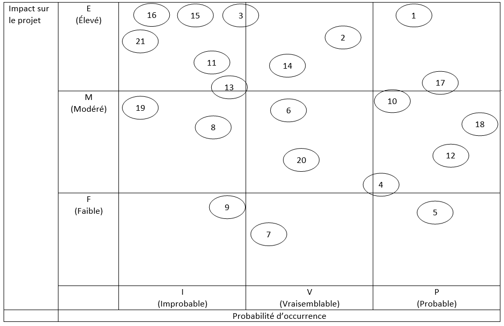
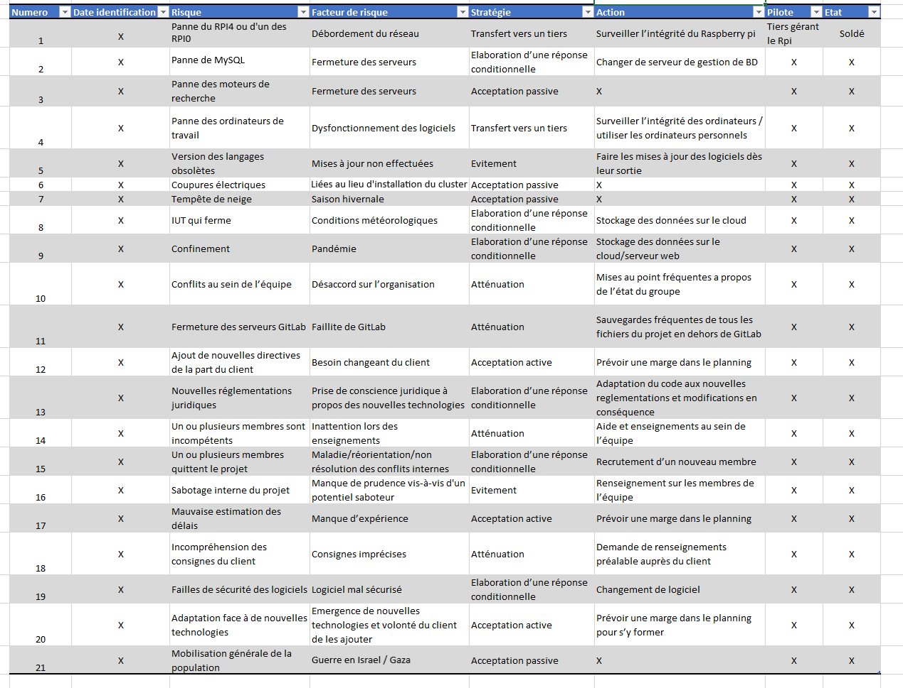

_Durand Antonin_  
_Jougla Maxime_  
_Parciany Benjamin_  
_Zehren William_

<h1 style="color:#5d79e7; text-align: center"> Gestion des risques du projet </h1>

<h1 style="color:#5d79e7; text-align: center; margin-top: 100px"> Table des matières</h1>

<ol>
    <li> <a href="#introduction"> Introduction  </a> </li>
    <li> <a href="#liste_risques"> Liste des risques identifiés liés au projet </a> </li>
    <ol>
        <li> <a href="#matrice_risques"> Matrice des risques </a> </li>
    </ol>
    <li> <a href="#impact"> Evaluation de l'impact des risques sur le projet  </a> </li>
    <li> <a href="#strategies"> Définition des stratégies de gestion de risques  </a> </li>
</ol>

<h2 style="color:#5d79e7; id=introduction"> Introduction </h2>

Tout au long de son déroulement, un projet est soumis à de nombreux risques qui doivent être anticipés, quantifiés et gérés. Ce document servira donc à identifier et définir ces risques, puis à évaluer leurs impacts potentiels sur le projet et enfin à définir une stratégie pour les gérer. 

<h2 style="color:#5d79e7; id=liste_risques"> Liste des risques identifiés liés au projet </h2>

1. Panne du RPI4 ou d'un des RPI0
2. Panne de MySQL
3. Panne des navigateurs de recherche
4. Panne des ordinateurs de travail 
5. Version des langages obsolètes
6. Coupures électriques (Liées au lieu d'installation du Cluster)
7. Tempête de neige (Chutes de neige importantes empêchant l’accès à la halle)
8. Fermeture de l'IUT
9. Confinement (Dû à une pandémie)
10. Conflits au sein de l’équipe 
11. Fermeture des serveurs GitHub
12. Ajout de nouvelles directives de la part du client
13. Nouvelles réglementations juridiques (Complexification des règles vis-à-vis des 
données personnelles par exemple)
14. Un ou plusieurs membres sont incompétents 
15. Un ou plusieurs membres quittent le projet
16. Sabotage interne du projet
17. Mauvaise estimation des délais
18. Incompréhension des besoins du client
19. Failles de sécurités des logiciels (piratage et modification des fichiers sur GitLab)
20. Adaptation face à de nouvelles technologies
21. Mobilisation générale de la population pour une entrée en guerre contre Israel/Gaza

Pour identifier les risques trouvés ci-dessus, nous avons réuni tous les membres du groupe afin de réfléchir à tous les risques pour notre projet. Nous avons orienté notre réflexion par thèmes : Financier, Environnemental, Humain, Temporel, Technique, Juridique, 
Organisationnel. En premier lieu nous avons procédé à un brainstorming, puis nous avons regroupé les 
risques semblables afin de ne pas avoir de répétitions.

<h2 style="color:#5d79e7; id=impact"> Evaluation de l'impact des risques sur le projet </h2>

Pour cette étape, nous allons définir les échelles suivantes : 
1) Probabilité d’occurrence, définie par 3 niveaux qui seront les suivants :
- Improbable
- Vraisemblable
- Probable
2) Impact sur le projet, également définie par 3 niveaux qui seront les suivants : 
- Faible : Risque de perte de temps minime 
- Modéré : Risque de perte de temps modérée / importante
- Elevé : Mise en danger de la survie du projet / impossibilité de faire le rendu à 
temps 

Nous allons ensuite classer chaque risque en fonction de ces deux échelles :

| Risques  	    | Probabilité d'occurence et Impact sur le projet                                                           	          
|---------------|-------------------------------------------------------------------------------------------------------------------------
| Risque 1:  	| Probabilité d’occurrence : Probable   Impact sur le projet : Elevé, possibilité de perte du projet complet          
| Risque 2:  	| Probabilité d’occurrence : Vraisemblable   Impact sur le projet : Elevé, possibilité de perte du projet complet    
| Risque 3:  	| Probabilité d’occurrence : Improbable   Impact sur le projet : Elevé, possibilité de perte du projet complet                                                                    	          
| Risque 4:  	| Probabilité d’occurrence : Probable   Impact sur le projet : Modéré, perte de temps. Possibilité d’utiliser les ordinateurs personnels des membres de l’équipe    
| Risque 5:  	| Probabilité d’occurrence : Probable   Impact sur le projet : Faible, Perte de temps minime                                                                                                 	          
| Risque 6:  	| Probabilité d’occurrence : Vraisemblable   Impact sur le projet : Modéré, Perte de temps                                                                                           	          
| Risque 7:  	| Probabilité d’occurrence : Vraisemblable   Impact sur le projet : Faible, Impossibilité de se voir à l’IUT
| Risque 8:  	| Probabilité d’occurrence : Improbable   Impact sur le projet : Modéré, impossibilité de se voir à l'IUT et de contacter les professeurs                                                                                                 	          
| Risque 9:  	| Probabilité d’occurrence : Improbable   Impact sur le projet : Faible, impossibilité de se voir en présentiel                                                                                                          	          
| Risque 10:  	| Probabilité d’occurrence : Probable   Impact sur le projet : Modéré, perte de temps et de synergie de groupe                                                                                                          	          
| Risque 11: 	| Probabilité d’occurrence : Improbable   Impact sur le projet : Elevé, possibilité de perte du projet complet                                                                                                          	          
| Risque 12: 	| Probabilité d’occurrence : Probable   Impact sur le projet : Modéré, nécessité de mettre en place de nouvelles itérations
| Risque 13: 	| Probabilité d’occurrence : Improbable   Impact sur le projet : Elevé, possibilité de devoir changer en partie le code et/ou la conception
| Risque 14: 	| Probabilité d’occurrence : Vraisemblable   Impact sur le projet : Elevé, perte de temps importante, nécessité de revoir l’organisation du projet
| Risque 15: 	| Probabilité d’occurrence : Improbable   Impact sur le projet : Elevé, perte de temps importante, nécessité de revoir l’organisation du projet
| Risque 16: 	| Probabilité d’occurrence : Improbable   Impact sur le projet : Elevé, possibilité de perte du projet complet
| Risque 17: 	| Probabilité d’occurrence : Probable   Impact sur le projet : Elevé, Projet incomplet lors du rendu, échec du projet
| Risque 18: 	| Probabilité d’occurrence : Probable   Impact sur le projet : Modéré, perte de temps 
| Risque 19: 	| Probabilité d’occurrence : Improbable   Impact sur le projet : Modéré, possible piratage des informations et du code du projet
| Risque 20: 	| Probabilité d’occurrence : Vraisemblable   Impact sur le projet : Modéré, Nécessité d’apprendre les nouvelles technologies
| Risque 21: 	| Probabilité d’occurrence : Improbable   Impact sur le projet : Elevé, impossibilité de donner suite au projet/de le rendre à temps

<h3 style="color:#5d79e7; id=matrice_risques"> Matrice des risques </h3>

<h2 style="color:#5d79e7; id=#strategies"> Définition des stratégies de gestion de risques  </h2>

Voici ci-dessous le plan d’action établi pour les risques listés précédemment.

