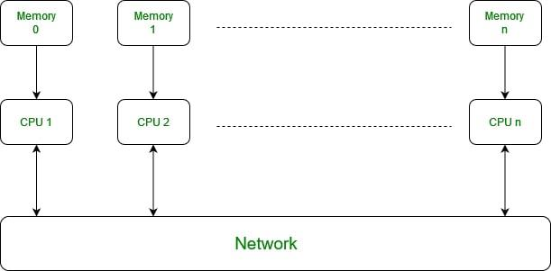
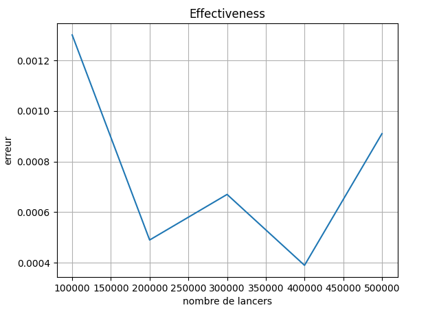

_Durand Antonin_ <br>
_Jougla Maxime_ <br>
_Parciany Benjamin_ <br>
_Zehren William_

<h1 style="color:#5d79e7; text-align: center"> Rapport de performance et de fonctionnement: Monte Carlo </h1>

<h1 style="color:#5d79e7; text-align: center; margin-top: 100px"> Table des matières</h1>

<ol>
    <li> <a href="#introduction"> Introduction  </a> </li>
    <ol>
    <li> <a href="#motivation"> Motivation  </a> </li>
    </ol>
    <li> <a href="#pres_code_archi"> Présentation du code et de l'architecture </a> </li>
    <ol>
    <li> <a href="#pres_archi"> Présentation de l'architecture </a> </li>
    <li> <a href="#pres_code"> Présentation du code </a> </li>
    </ol>
    <li> <a href="#pres_crit_obj"> Présentation des critères de qualité et des objectifs </a> </li>
    <ol>
        <li> <a href="#efficiency"> Efficiency </a> </li>
        <ol>
            <li> <a href="#def_effi"> Définition du critère </a> </li>
            <li> <a href="#obj_effi"> Objectif à atteindre </a> </li>
            <li> <a href="#speed_up"> Speedup </a> </li>
            <li> <a href="#scalabilite"> Scalabilité </a> </li>
            <ol>
                <li> <a href="#scalabilite_forte"> Scalabilité forte </a> </li>
                <li> <a href="#scalabilite_faible"> Scalabilité faible</a> </li>
            </ol>
        </ol>
        <li> <a href="#effectiveness"> Effectiveness </a> </li>
        <ol>
            <li> <a href="#def_effec"> Définition du critère </a> </li>
            <li> <a href="#obj_effec"> Objectif à atteindre </a> </li>
        </ol>
    </ol>
    <li> <a href="#tests"> Tests </a> </li>
    <ol>
        <li> <a href="#test_effi"> Test de l'Efficiency </a> </li>
            <ol>
            <li> <a href="#test_Speedup"> Test du Speedup </a> </li>
            <li> <a href="#test_scalabilite"> Test de la scalabilité </a> </li>
                <ol>
                <li> <a href="#test_scaforte"> Test de la scalabilité forte </a> </li>
                <li> <a href="#test_scafaible"> Test de la scalabilité faible </a> </li>
                </ol>
            </ol>
        <li> <a href="#test_effec"> Test de l'Effectiveness </a> </li>
        <li> <a href="#test_limite"> Test des limites du programme </a> </li>
    </ol>
    <li> <a href="#conclusion"> Conclusion  </a> </li>
</ol>


<h2 style="color:#5d79e7; page-break-before: always" id="introduction"> 1) Introduction </h2>

#### Avertissement : Ce rapport à été effectué après la réalisation du rapport personnel sur la performance de l'algorithme de Monte Carlo en cours de qualité de développement. Il est donc possible que des parties similaires aux rapports des membres de notre groupe de SAE se retrouvent dans ce rapport. 

Ce rapport aura pour but d’expliquer le fonctionnement général de l’algorithme de Monte Carlo, ainsi que le fonctionnement du programme DistributedParallelMC qui utilise cet algorithme pour approximer Pi. Nous réaliserons ensuite des tests qui auront pour but de démontrer ou non, le respect des critères de qualité dits d’Efficiency et d’Effectiveness en les ayant définis au préalable. 

En effet, selon les cours de qualité de développement et les normes ISO telles que la norme ISO 25010:2011 et la norme ISO 25022:2012, un programme, un logiciel ou un site web se doit de répondre à des critères de qualité pour répondre au besoin des utilisateurs et leur permettre une expérience optimale. 

<h3 style="color:#5d79e7" id="motivation"> 1.1) Motivation </h3>

L’objectif principal de ce rapport est de comparer les résultats des tests sur le matériel de l'IUT aux résultats des tests sur Cluster Kit Hat. Il est également indispensable de démontrer si notre projet respecte ou non les critères de qualités définis précédemment et donc s'il respecte les besoins en termes de qualité des utilisateurs de notre site web. 

<h2 style="color:#5d79e7; page-break-before: always" id="pres_code_archi">2) Présentation du code et de l'architecture</h2>

Il a été décidé de ne pas utiliser le code java fournit par Mr Dufaud durant le cours de Qualité de développement et de développer un code en python utilisant la librairie MPI et s'inspirant du code prime.py fournit par Mr Hoguin.

<h3 style="color:#5d79e7" id="#pres_archi"> 2.1) Présentation de l'architecture </h3>

MPI utilise un pattern SPMD pour "Single Programm Multiple Data", celà signifie que les workers et le master partagent le même programme. Le programme est ensuite exécuté en même temps sur des données différentes.



__Figure 1 : Schéma d'une architecture propice au fonctionnement d'un programme distribué utilisant un pattern SPMD__

Le pattern SPMD présente les caractéristiques suivantes : 
- Approche : Plusieurs processeurs exécute le même programme chacun sur des données différentes
- Parallélisme : Parallélisme sur les données
- Communication : Communication entre les  processeurs requises
- Mémoire : Chaque processeur à sa propre mémoire
- Usage : Utilisé majoritairement sur des clusters 

Nous avons donc choisit cette approche car notre clusterHat présente toutes les caractéristiques requises a sa mise en place. En effet chaque raspberry possède sa propre mémoire et peuvent communiquer ensemble facilement avec ssh.

<h3 style="color:#5d79e7" id="#pres_code"> 2.2) Présentation du code </h3>

On développe donc le code [pi_monte_carlo](../../../src/PYTHON/pi_monte_carlo.py) qui sera ensuite partagé sur tous les raspberrys du cluster.

```pi_monte_carlo.py``` est un script qui prend en argument le nombre de lancers que l'on souhaite effectuer et le nom du fichiers dans lequel sera stocké les résultats de l'exécution du programme. Le script utilise la méthode probabiliste de MonteCarlo pour estimer la valeur numérique de Pi. A la fin on renvoie le temps d'exécution, la valeur de Pi calculé et l'erreur relative par rapport à la valeur de pi stocké dans la bibliothèque math de Python.

Le fonctionnement du programme est similaire à celui de ```prime.py```. En effet au début du programme on utilise les fonctions de MPI pour donner au programme les informations sur son identité (worker ou master) et sur la taille du cluster. Ensuite on récupère le nombre de lancers et le nom du fichier en lisant les arguments en ligne de commande. Enfin on peut commencer la méthode de monteCarlo en répartissant le travail en fonction du nombre de workers.

__Comment calculer Pi avec une méthode de Monte Carlo ?__

La méthode est la suivante : 

On considère un quart de disque de rayon 1 dans un carré de coté 1. On effectue des tirages de points aléatoires dans ce carré en utilisant par exemple une loi uniforme sur l'ensemble [0 , 1].


__Figure 2 : Animation du tirage de 300 000 points aléatoire dans un carré de coté 1__

L'aire du quart de disque vaut $A_d = \frac{\pi* r^2}{4}$ soit $\frac{\pi}{4}$ car $r=1$. L'aire du carré vaut 1 et la probabilité d'obtenir un point dans le quart de disque vaut $ P=\frac{A_d}{A_c} = \frac{\frac{\pi}{4}}{1} = \frac{\pi}{4}$

Un point est dans le quart de disque si sa distance euclidienne au centre du disque est inférieur au rayon du disque. Soit $x_p^2 + y_p^2 < 1$

Soit $n_c$ le nombre de point dans la cible et $n_t$ le nombre total de tirage on peut estimer la valeur de pi de la manière suivante : 
$$\pi = 4  * \frac{n_c}{n_t}$$


__Implémentation avec Python__

```python
# Make a note of the start time
start = time.time()
count = 0
# Loop through the numbers using rank number to divide the work
for candidate_number in range(round(throws/cluster_size)):
    x = random()
    y = random()

    if ((x * x + y * y)< 1):
        count +=1
```

Dans cette implémentation la parallélisation intervient dans la division du nombre de lancer en fonction de la taille du cluster et toutes les opérations faites dans la boucle peuvent être effectué de manière indépendante sur chaque worker. Le master travaille aussi dans cette implémentation.

__Récupération des résultats et calcul de Pi__

```python
# Once complete, send results to the governing node
results = comm.gather(count, root=0)

# If I am the governing node, show the results
if my_rank == 0:
    # How long did it take?
    total = sum(results)
    pi_calc = 4.0 * total / throws
    end = round(time.time() - start, 2)
    error = abs((pi_calc - pi))/pi
```

On utilise la fonction gather de mpi qui permet de récupérer toutes les valeurs d'une variable de chaque programme et des les rassembler dans une liste. On peut ensuite sommer cette liste pour obtenir $n_c$ et calculer Pi avec la formule défini plus haut.

Avec le test du rang on s'assure que seulement le master s'occupe de traiter les résultats.


<h2 style="color:#5d79e7; page-break-before: always" id="pres_crit_obj">3) Présentation des critères de qualité et des objectifs</h2>

<h3 style="color:#5d79e7;" id="efficiency"> 3.1) Efficiency </h3> 

<h4 style="color:#5d79e7;" id="def_effi">  3.1.1) Définition du critère </h4>

Selon la norme ISO 25010:2012, le critère de qualité Efficiency correspond à l’efficacité, et dans notre cas, à la vitesse avec laquelle les utilisateurs atteignent les objectifs spécifiés.  

<h4 style="color:#5d79e7;" id="obj_effi"> 3.1.2) Objectif à atteindre </h4>

Cependant, l'objectif à atteindre ici pour considèrer que le critère de l'Efficiency est respecté ou non va dépendre du Speedup, de la scalabilité forte ainsi que de la scalabilité faible. On ne peut en effet pas déterminer si un temps d'execution est acceptable ou non sans considérer ces éléments.

<h4 style="color:#5d79e7;" id="speed_up"> 3.1.3) Speedup </h4>

Le Speedup est un principe général du calcul haute performance ayant entre autres pour objectif d'aider
à déterminer l'Efficiency d'un programme ou d'un logiciel. Il correspond au phénomène d'augmentations de
ressources de calcul allouées à l'exécution d'un programme et donc à une augmentation des performances.

La formule du Speedup est la suivante : $Speedup = \frac{Temps_1}{Temps_n}$ 

Dans notre cas, cette augmentation de ressources correspond à une augmentation de threads. Par conséquent, le Speedup correspond ici au rapport entre la vitesse d'exécution de référence (pour un thread) et la vitesse
d'exécution pour n threads 

De ce principe, on retire le principe de la scalabilité

<h4 style="color:#5d79e7;" id="scalabilite"> 3.1.4) Scalabilité </h4>

La scalabilité correspond à la capacité d'un programme à utiliser des ressources de calcul supplémentaires.
Cette dernière se décline en deux formes : La scalabilité forte et la scalabilité faible.

<h5 style="color:#5d79e7;" id="scalabilite_forte"> 3.1.4.1) Scalabilité forte </h5>

La scalabilité forte correspond au gain de vitesse d'exécution en fonction du nombre de threads. Cela signifie,
par exemple, que si on double le nombre de threads s'occupant d'une tache, cette tâche est censée s'exécuter
deux fois plus vite.

Dans l'idéal, l'objectif serait de retrouver ce gain de vitesse d'exécution linéaire lors de l'augmentation du nombre de threads. Cependant, ce gain ne se retrouve pas forcément dans la théorie, et encore moins dans la pratique.

L'objectif sera par conséquent d'atteindre un speed up linéaire ou presque linéaire. 

<h5 style="color:#5d79e7;" id="scalabilite_faible"> 3.1.4.2) Scalabilité faible </h5>

La scalabilité faible correspond à la conservation d'une vitesse d'exécution constante si l'on augmente le
nombre de threads ainsi que le nombre de lancers (experiences aléatoires) de manière proportionnelle. Cela
signifie, par exemple, que si on double le nombre de threads et le nombre de lancers lors de l'exécution du
programme, la vitesse d'exécution est censée etre la même qu'avant cette augmentation.

Comme pour le cas de la scalabilité forte, l'objectif, dans l'idéal, serait de retrouver cette conservation de la vitesse d'exécution mais elle n'est pas toujours possible dans la théorie et encore moins dans la pratique.

L'objectif sera par conséquent d'atteindre un speed up linéaire ou presque linéaire. 

<h3 style="color:#5d79e7; page-break-before: always" id="effectiveness"> 3.2) Effectiveness </h3>

<h4 style="color:#5d79e7;" id="def_effec"> 3.2.1) Définition du critère </h4>

Selon la norme ISO 25010:2012, le critère de qualité Effectiveness correspond à l’exactitude (la précision) et la
complétude avec lesquelles les utilisateurs atteignent les objectifs spécifiés.

Dans notre cas, nous cherchons à calculer Pi à l'aide de l'algorithme de Monte Carlo. On récupère donc une
approximation de la valeur de Pi. On pourrait, par exemple, considérer que ce critère de qualité est rempli
lorsqu'on trouve une valeur de Pi approximée égale à 0.001 près à la valeur réele de Pi.

Dans le cas de notre programme, la valeur de Pi dite réele est égale à 3.141592653589793, c'est la valeur
utilisée dans la classe Math de Java.

Par ailleurs, on calcule l'erreur entre la valeur approximée de Pi et la valeur dite réele de Pi de la manière
suivante : 

$Erreur = \frac{Pi_a - Pi_r}{Pi_r}$ 

<h4 style="color:#5d79e7;" id="obj_effec"> 3.2.2) Objectif à atteindre </h4>

Trouver la valeur réele pourrait être un objectif à atteindre pour considèrer que le critère de l'Effectiveness a
bien été atteint ou non, mais serait bien trop coûteux et long à trouver à l'aide de tests, et d'autres critères de
qualité s'en retrouveraient fortement impactés négativement.

Ici, l'objectif à atteindre pour considèrer que le critère de l'Effectiveness est atteint ou non, sera une valeur
approximée de Pi égale à 0.001 près de la valeur réele de Pi et donc une erreur inférieure à $1\times10^{-3}$.


<h2 style="color:#5d79e7; page-break-before: always" id="tests"> 4) Tests </h2>

L'architecture matérielle à notre disposition est donc la suivante : 

Un RPI principal qui sert de **Manager** et qui est un Raspberry Pi 4 Model B. Le processeur, d'architecture 32 bits, est composé de 4 coeurs chacun cadencés à 1.5Ghz et de 4 threads. La taille de la mémoire ram est de 4Go.

Pour ce qui est des 4 autres RPI, qui servent donc de **Workers**, ce sont des Raspberry Pi Zero W Rev 1.1, le processeur utilise l'architecture _ARMv6-compatible processor rev7 (v61)_. L'architecture est donc de type 32 bits. Le processeur possède 1 coeur cadencé à 1Ghz ainsi qu'1 thread. La taile de la mémoire ram est de 512Mo.

Tous les tests à venir seront réalisés selon un environnement de test défini ici :

- Les tests seront tous réalisés sur 4 Workers (qui correspondent aux 4 RPI Zero du cluster). Ils se feront également avec un coeur et un thread par worker, étant donné que les workers n'en possèdent qu'un. 

- Chaque test sera répété 5 fois puis les résultats de chaque instance d'un test seront divisés par 5 pour
obtenir une moyenne. Les résultats obtenus seront alors inscrits dans leurs tableaux respectifs

<h3 style="color:#5d79e7;" id=test_effi"> 4.1) Test de l'Efficiency </h3>

Pour réaliser les tests de l'Efficiency, il faut choisir des valeurs en corrélation avec l'architecture matérielle du Cluster Kit Hat pour trouver le nombre de thread le plus optimisé, celui qui remplira au mieux le critère d'Efficiency. 

Les tests se feront donc de deux manières différentes, avec un coeur et donc un thread (sans calcul distribué) et avec 4 coeurs et donc 4 threads (avec calcul distribué).

On ne pourra pas réaliser de graphiques intéressants à analyser avec seulement deux tests, cette partie n'en contiendra donc pas. 

Le nombre de lancers de base restera fixe et sera de 100 000 pour les tests du Speedup, de la scalabilité forte ainsi que pour la scalabilité faible. 

<h4 style="color:#5d79e7;" id="test_Speedup"> 4.1.1) Test du Speedup </h4>

On va ensuite augmenter progressivement le nombre de threads à chaque nouveau test pour observer l'augmentation ou non de performances. 

On rappelle ici la formule du Speedup : 

$$Speedup = \frac{Temps_1}{Temps_n}$$

| Coeurs  | Temps d'exécution (en s)  | Speedup |
| ------- | ------------------------- | ------- |
| 1       |           6,6             | 1       |
| 4       |           2,14            | 3,1     |

On voit ici que le speedup est plutot proportionnel à l'augmentation de coeurs : multiplication x4 de la ressource matérielle et multiplication x3,1 de la performance. On a donc une évolution plutot linéaire.

On va considérer que l'objectif en matière de speed up est rempli étant donné son évolution plutot linéaire et donc conforme à l'objectif fixé préalablement.


<h4 style="color:#5d79e7; page-break-before: always" id="test_scalabilite"> 4.1.2) Test de la scalabilité </h4>

<h5 style="color:#5d79e7;" id="test_scaforte"> 4.1.2.1) Test de la scalabilité forte </h5>

On utilise le speed up précédemment défini pour calculer la performance de notre module. 

| Coeurs  | Nombre de lancers par Thread | Temps d'exécution (en s)   | Speed Up       |
| ------- | ---------------------------- | -------------------------- | -------------- |
| 1       | 100 000                      |   5,98                     | 1              |
| 4       | 25 000                       |   1,48                     | 4              |

On voit ici que le speedup est proportionnel à l'augmentation de coeurs : multiplication x4 de la ressource matérielle et multiplication x4 de la performance. On a donc une évolution linéaire.

On va considérer que l'objectif en matière de scalabilité forte est rempli étant donné son évolution plutot linéaire et donc conforme à l'objectif fixé préalablement. On va donc considérer que pour 100 000 lancers, utiliser 4 coeurs est optimal et permet un gain de temps considérable. 

<h5 style="color:#5d79e7;" id="test_scafaible"> 4.1.2.2) Test de la scalabilité faible </h5>

On utilise le speed up précédemment défini pour calculer la performance de notre module.

| Coeurs | Nombre de lancers | Temps d'exécution (en s) | Speed up |
| ------ | ----------------- | ------------------------ | -------- |
| 1      | 100 000           | 4,83                     | 1        |
| 4      | 400 000           | 5,77                     | 0.8      |

On voit ici que le speedup est n'est pas du tout proportionnel à l'augmentation de coeurs : multiplication x4 de la ressource matérielle et du nombre de lancers, multiplication x0.8 de la performance. L'évolution est donc plutot linéaire. (Dans l'idéal, on voudrait avoir une multiplication de la performance par 1, donc pas de changements en termes de temps d'execution).

On va considérer que l'objectif en matière de scalabilité faible est rempli étant donné son évolution plutot linéaire et donc conforme à l'objectif fixé préalablement. On va donc considérer que pour 100 000 lancers, utiliser 4 coeurs est reste optimal pour faire ses estimations de Pi. 

<h3 style="color:#5d79e7;" id="test_effec"> 4.2) Test de l'Effectiveness </h3>

Pour tester l'Effectiveness, on cherche à trouver un nombre de lancers optimal qui nous permettra de remplir notre objectif défini précédemment : une erreur inférieure à $1\times10^{-3}$. 

Les tests se feront avec 4 coeurs et donc 4 threads (avec calcul distribué).

On va également choisir un nombre de lancers de base égal à 100 000 puis faire augmenter cette valeur par deux plusieurs fois pour tester différents cas de figure et essayer d'en obtenir un remplissant notre objectif. 

L'erreur se calcule avec la formule donnée précédemment, dans la présentation du critère d'Effectiveness : 

$$Erreur = \frac{Pi_a - Pi_r}{Pi_r}$$ 

| Nombre de lancers | Erreur                  | Temps d'exécution (en s)  |
| ----------------- | ----------------------- | ------------------------- |
| 100 000           | 1,3×10-3                |  2,26                     |       
| 200 000           | 4,9×10-4                |  4,91                     |             
| 300 000           | 6,7×10-4                |  5,66                     |     
| 400 000           | 3,9×10-4                |  9,57                     |   
| 500 000           | 9,1×10-4                |  12,07                    |       

<div style="text-align:center">

<p>Figure 2 : Scalabilité faible en fonction du temps et du nombre de threads</p>
</div>

On voit ici qu'on obtient une erreur inférieure à la valeur fixée lors de la définition des objectifs. On va donc considèrer que le nombre de lancers optimal pour trouver une bonne valeur de pi sans prendre trop de temps de calcul est 300 000.

<h2 style="color:#5d79e7; page-break-before: always" id="conclusion"> 5) Conclusion </h2>

Les critères de qualité de l'Effectiveness et de l'Efficiency sont donc bien respectés et remplis par notre application car on a atteint les objectifs fixés en début de rapport. Ce programme reparti utilisant l'algorithme de Monte Carlo respecte donc entièrement les besoins en termes de qualité des utilisateurs. 